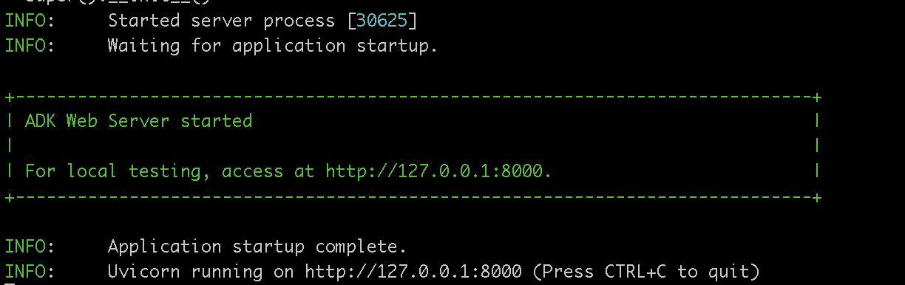
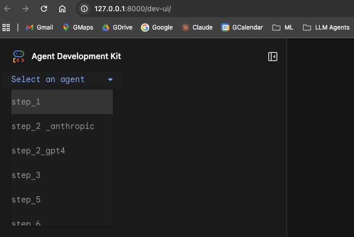

## Agent Team

This tutorial extends from the [multi tool agent](../multi_tool_agent/agent.py), to construct a more sophisticated **multi-agent system**.

Starting with a single agent that can look up weather, we will are adding capabilities like:
- Leveraging different AI models (Gemini, GPT, Claude).
- Designing specialized sub-agents for distinct tasks (like greetings and farewells).
- Enabling intelligent delegation between agents.
- Giving agents memory using persistent session state.
- Implementing crucial safety guardrails using callbacks.

To be more specific, we will focus on:
- **Tool Definition & Usage**: Crafting Python functions (`tools`) that grant agents specific abilities (like fetching data) and instructing agents on how to use them effectively.
- **Multi-LLM Flexibility**: Configuring agents to utilize various leading LLMs (Gemini, GPT-4o, Claude Sonnet) via LiteLLM integration, allowing you to choose the best model for each task.
- **Agent Delegation & Collaboration**: Designing specialized sub-agents and enabling automatic routing (`auto flow`) of user requests to the most appropriate agent within a team.
- **Session State for Memory**: Utilizing `Session State` and `ToolContext` to enable agents to remember information across conversational turns, leading to more contextual interactions.
- **Safety Guardrails with Callbacks**: Implementing `before_model_callback` and `before_tool_callback` to inspect, modify, or block requests/tool usage based on predefined rules, enhancing application safety and control.


### Execution environments.
If you prefer to use a notebook experience with Google Colaab, please refer to this [agent-team tutorial](https://google.github.io/adk-docs/tutorials/agent-team/)

The below and next steps are more taylored towards a manual runner/session setup using ADK's standard tools, also documented [here](https://github.com/google/adk-docs/tree/main/examples/python/tutorial/agent_team/adk-tutorial)


### Prerequisites
- Python: Version 3.9 - 3.12 (Check ADK documentation for the latest compatibility).
- Git: To clone this repository.
- LLM API Keys (optional): You will need API keys for the services used in the tutorial steps (Google Gemini, potentially OpenAI and Anthropic).
Google AI Studio: https://aistudio.google.com/app/apikey
OpenAI Platform: https://platform.openai.com/api-keys
Anthropic Console: https://console.anthropic.com/settings/keys

### Setup Instructions
See packave install in parent [readme](../README.md). 

And make sure you have approviprate API keys in the `.env` file
Ensure your virtual environment is activated.

#### 1. Clone repo
```shell
git clone https://github.com/google/adk-docs.git
cp -pr adk-docs/examples/python/tutorial/agent_team/adk-tutorial/ agent_team/
cd agent_team/
```

#### 2. Run the command
```shell
adk web
```
#### 3. This will start a local web server and likely open a new tab in your browser.


#### 4. In the web UI, you'll find a dropdown menu (usually on the left). Use this dropdown to select the agent step you want to interact with (e.g., step_1, step_2_gpt4, step_6).


#### 5. Once selected, you can type messages in the chat interface to interact with the agent for that specific step.


### Using adk run (Command-Line Interaction)
The `adk run` command allows you to interact with an agent directly from your terminal. You typically specify the path to the agent file.

Example (running Step 1):
```shell
# Make sure you are in the main 'adk-tutorial' folder
adk run step_1
```
For detailed usage and options for adk run, please refer to the [Official ADK Documentation - Run Your Agent](https://google.github.io/adk-docs/get-started/quickstart/#terminal-adk-run).


### Using adk api_server (Exposing as API)
The adk api_server command starts a FastAPI server, exposing your agent via an API endpoint.

Example (serving Step 1):
```shell
# Make sure you are in the main 'adk-tutorial' folder
adk api_server
```
For detailed usage, API endpoint structure, and options for adk api_server, please consult the [Official ADK Documentation - Testing your Agents](https://google.github.io/adk-docs/get-started/testing/).


#### Resources:
 - [adk-tutorial](https://github.com/google/adk-docs/tree/main/examples/python/tutorial/agent_team/adk-tutorial)
 - [google collab version of adk tutorial](https://github.com/google/adk-docs/blob/main/examples/python/tutorial/agent_team/adk_tutorial.ipynb)

Go back to parent Readme: [click here](../README.md)